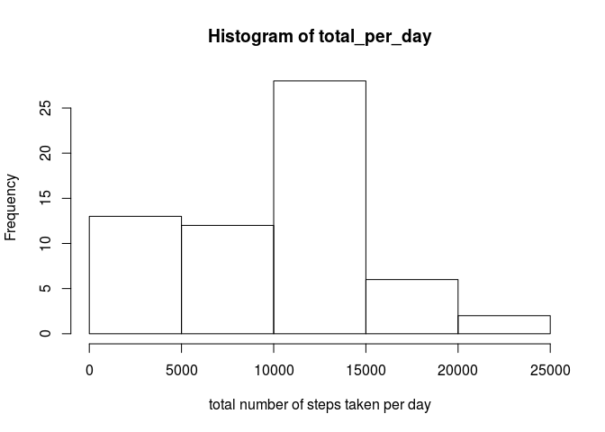

# Reproducible Research: Peer Assessment 1


## Loading and preprocessing the data

```r
steps <- read.csv(unzip("activity.zip"))
steps$interval <- factor(steps$interval)
```

## What is mean total number of steps taken per day?

```r
# Count total number of steps per day
total_per_day <- tapply(steps$steps, steps$date, sum, na.rm = T)
# Histogram of total number of steps per day
hist(total_per_day, xlab = "total number of steps taken per day")
```

 

```r
# Calculate mean and median
mean_total_per_day <- mean(total_per_day)
median_total_per_day <- median(total_per_day)
mean_total_per_day
```

```
## [1] 9354.23
```

```r
median_total_per_day
```

```
## [1] 10395
```
The mean total numer of steps taken per day: 9354.2295082

The median total numer of steps taken per day: 10395

## What is the average daily activity pattern?

```r
# Calculate the average number of steps per interval
average_n_steps <- tapply(steps$steps, steps$interval, mean, na.rm = T)
# Create plot
plot(levels(steps$interval), average_n_steps, type = "l", xlab = "interval", ylab = "average number of steps")
```

 

```r
max <- max(average_n_steps)
higest_interval <- names(which(average_n_steps == max))
```

The interval that contains the maximum number of steps: 835

## Imputing missing values

```r
# Calculate and report the total number of missing values in the dataset
sum(!complete.cases(steps))
```

```
## [1] 2304
```

```r
filled <- steps
count <- 0
for (i in is.na(steps$steps)) {
  count <- count + 1
  if (i) {
    interval <- steps$interval[count]
    average <- average_n_steps[as.character(interval)]
    filled$steps[count] <- average
  }
}
# Count total number of steps per day
total_per_day <- tapply(filled$steps, filled$date, sum, na.rm = T)
# Histogram of total number of steps per day
hist(total_per_day, xlab = "total number of steps taken per day")
```

 

```r
# Calculate mean and median
mean_total_per_day <- mean(total_per_day)
median_total_per_day <- median(total_per_day)
mean_total_per_day
```

```
## [1] 10766.19
```

```r
median_total_per_day
```

```
## [1] 10766.19
```

## Are there differences in activity patterns between weekdays and weekends?

```r
count <- 0
wdays = character()
for (i in filled$date) {
  num <- as.POSIXlt(i)$wday
  day <- if (num == 0) {"weekend"} else if (num < 6) {"weekday"} else {"weekend"}
  wdays <- c(wdays, day)
}
filled$day <- factor(wdays)
# Create two groups
weekends <- filled[filled$day == "weekend", ]
weekdays <- filled[filled$day == "weekday", ]
we_average_n_steps <- tapply(weekends$steps, weekends$interval, mean)
wd_average_n_steps <- tapply(weekdays$steps, weekdays$interval, mean)

# No plot
```
